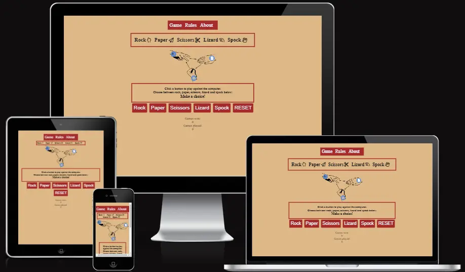
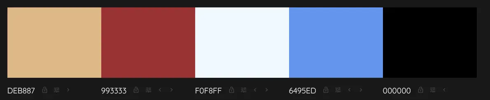
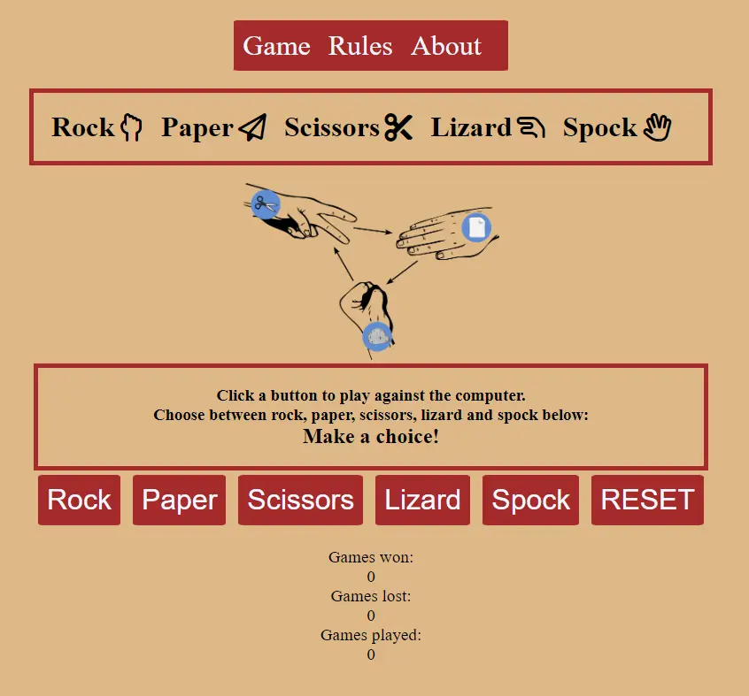
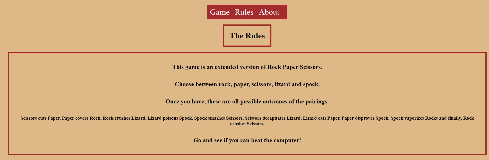
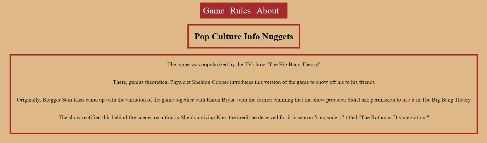
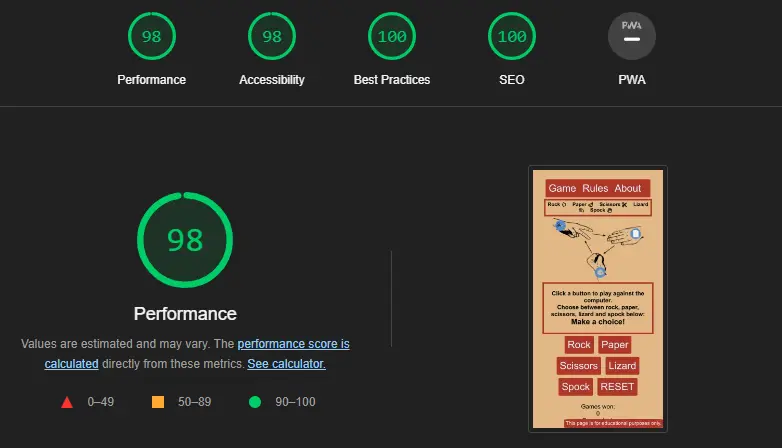
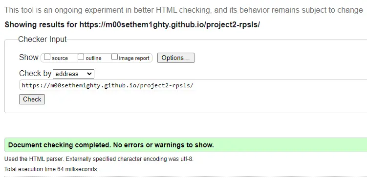
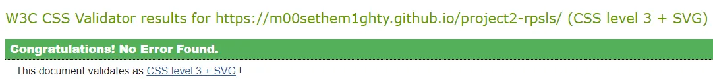

# Rock, Paper, Scissors, Lizard, Spock

This site provides the game Rock, Paper, Scissors, Lizard, Spock to play online.

<em>The Website is already live: [HERE][responsivedesign]</em>

## Table of Contents

+ [UX](#ux "UX")
  + [Site Purpose](#site-purpose "Site Purpose")
  + [Site Goal](#site-goal "Site Goal")
  + [Audience](#audience "Audience")
  + [Communication](#communication "Communication")
  + [Current User Goals](#current-user-goals "Current User Goals")
  + [New User Goals](#new-user-goals "New User Goals")
+ [Design](#design "Design")
  + [Colour Scheme](#colour-scheme "Colour Scheme")
  + [Typography](#typography "Typography")
  + [Imagery](#imagery "Imagery")
+ [Features](#features "Features")
  + [Existing Features](#existing-features "Existing Features")
+ [Testing](#testing "Testing")
  + [Validator Testing](#validator-testing "Validator Testing")
+ [Technologies Used](#technologies-used "Technologies Used")
  + [Main Languages Used](#main-languages-used "Main Languages Used")
  + [Frameworks, Libraries & Programs Used](#Frameworks,-Libraries-&-Programs-Used "Frameworks, Libraries & Programs Used")
+ [Deployment](#deployment "Deployment")
+ [Credits](#credits "Credits")
  + [Content](#content "Content")
  + [Media](#media "Media")

## UX

### Site Purpose

A fun little game to play against the computer to kill some time.

### Site Goal

Let the player play against the computer and track the score and the amount of games played.

### Audience

People under the age of 40. The show 'The big Bang Theory' popularised the game when mentioning it in one of their episodes.

### Communication

With a minimalistic design, the page content is easy to identify and makes the purpose of the site obvious.

### Current User Goals

Track the score and maybe implement a scoreboard to encourage coming back to play.

### New User Goals

+ to navigate the site with ease & clearly understand the purpose of the site.
+ have fun playing the game without the necessity to prepare much.

## Design

### Colour Scheme

These are the used colors in order: burlywood, brown, aliceblue, cornflowerblue and black.  

Burlywood was used as the body's background color. The redish brown pops the content and buttons nicely off the background.  
The general text-content color is black. 
In contrast the buttons and navbar have aliceblue as font color to distinguish them. 
To make sure it is obvious that buttons/nav-elements are supposed to be clicked the text color changes to cornflowerblue on hover. 

### Typography

The fonts are set to default.

### Imagery

All the images found on the website are free stock images from [Pixabay][def3].  
The image is supposed to highlight that the game is a version of rock paper scissors.

## Features

### Existing Features

#### Navigation Bar

Included over all pages. makes it possible to easily navigate between the pages. 

#### Games Page(=index.html)

A simple layout, which makes the purpose of the page obvious. 

#### Rules Page(=rules.html)

Explains the general rules of the game. 

#### About Page(=about.html)

Gives some background information to the origins of the game for those interested. 

### Testing

+ I tested the page with DevTools in Chrome, Firefox and Edge and encountered no issues.  
+ The site is responsive and formats correctly until a width of 320px. 

### Validator Testing

#### Lighthouse

The page's lighthouse score: 

#### W3C

The page passed through the W3C validation:

#### Jigsaw

The page passed through the jigsaw validator: 

## Technologies Used

### Main Languages Used

+ HTML5
+ CSS3
+ JavaScript

### Frameworks, Libraries & Programs Used

+ Font Awesome - to add icons the header
+ CodeAnywhere/VS Code
+ GitHub - to store my repository for submission.
+ Am I Responsive? - shows responsiveness over all device sizes.

## Deployment

The site was deployed to GitHub pages. The steps to deploy are as follows:

+ In the GitHub repository, navigate to the Settings tab
+ In the left side menu under Code and Automation find Pages and click it.
+ This opens GitHubPages. On the top you can find the link to the live page. The Visit Button brings you there automatically in a new tab.
+ The live link can be found [HERE](https://m00sethem1ghty.github.io/project2-rpsls/
) as well.

## Credits

The template for this readme was taken(after asking) from my mentors project [LaLucha][def6]. 
She also turned me onto using flexbox for styling the site. This site was used for learning the flexbox basics: [FlexBoxFroggy][def7]. 

Thank you Lauren!

I have some knowledge from certifications I did outside of CodeInstitute so I relied less on sources from the internet. 
[freeCodeCamp Certification][freecode]
[freeCodeCamp Certification2](https://www.freecodecamp.org/certification/MightyM00se/javascript-algorithms-and-data-structures)

About section content: <https://screenrant.com/big-bang-theory-sheldon-rock-paper-scissors-rules/>

Stack Overflow provided the idea to call multiple functions with one:
<https://stackoverflow.com/questions/25028853/addeventlistener-two-functions>

### Content

The content was inspired by one of the project suggestions given in the course material.

### Media

Here are the free stock pictures from pixabay:
<https://pixabay.com/vectors/fingers-fist-hands-paper-rock-149296/>

This image was used for the favicon:
https://pixabay.com/vectors/rock-paper-scissors-rock-hand-296854/ 

[Favicon.io][def2] was used to convert it to the right size. 

[def2]: https://favicon.io
[def3]: https://pixabay.com/
[def6]: https://github.com/CluelessBiker/project1-la-lucha
[def7]: https://flexboxfroggy.com/
[freecode]: https://www.freecodecamp.org/certification/MightyM00se/responsive-web-design
[responsivedesign]: https://m00sethem1ghty.github.io/project2-rpsls/
